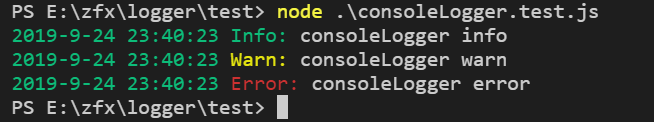
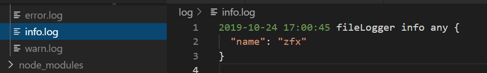
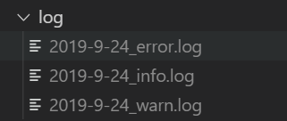

# logger
logger for nodejs

## Install

```sh
$ npm i @zhangfuxing/logger
```  

## options
### constructor  
* `logToFile` optional, Whether to write to a file
  - default: false
* `dir` optional, log folder location
  - default: './log'
* `byDay` optional, Whether to cut by day
  - default: false

### info  
* `message` The message to write  

### warn  
* `message` The message to write  

### error
* `message` The message to write  


## Useage  

### console logger  

```js
const Logger = require('@zhangfuxing/logger');

const logger = new Logger();

logger.info('consoleLogger info');
logger.warn('consoleLogger warn');
logger.error('consoleLogger error');
```  

  

### file logger  

```js
const Logger = require('@zhangfuxing/logger');

const logger = new Logger({
  logToFile: true,
  dir: './log'
});

logger.info('fileLogger info');
logger.warn('fileLogger warn');
logger.error('fileLogger error');
```  

 

### file logger cut by day

```js
const Logger = require('@zhangfuxing/logger');

const logger = new Logger({
  logToFile: true,
  dir: './log',
  byDay: true 
});

logger.info('fileLogger info');
logger.warn('fileLogger warn');
logger.error('fileLogger error');
```  

  

More screenshots in the `screenshots` folder.

## Test

```sh
$ npm test
```  