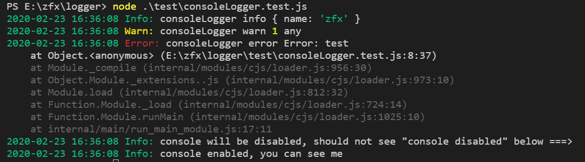
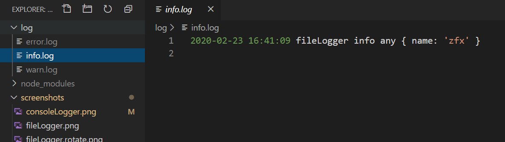

# logger
logger for nodejs

## Install

```sh
$ npm i @zhangfuxing/logger
```  

Node.js 12+ required (Because of use Class private fields)

## options
When isTTY is false, logger will not write to terminal.

### constructor  
* `dir`  optional, if the folder path is given, it will log to file
* `rotate` optional, Whether rotate logs by day
  - default: false
* `disableConsole` optional, disable write to terminal
  - default: false

### info  
* `message` The message to write  

### warn  
* `message` The message to write  

### error
* `message` The message to write  

### disable 
disable write to terminal and file for unit testing  
 
## Useage  

### console logger  

```js
const Logger = require('@zhangfuxing/logger');

const logger = new Logger();

logger.info('consoleLogger info');
logger.warn('consoleLogger warn');
logger.error('consoleLogger error');
```  

  

### file and console logger  

```js
const Logger = require('@zhangfuxing/logger');

const logger = new Logger({
  dir: './log'
});

logger.info('fileLogger info');
logger.warn('fileLogger warn');
logger.error('fileLogger error');
```  

 

### file logger only

```js
const Logger = require('@zhangfuxing/logger');

const logger = new Logger({
  dir: './log',
  disableConsole: true
});

logger.info('fileLogger info');
logger.warn('fileLogger warn');
logger.error('fileLogger error');
```  

### file logger cut by day

```js
const Logger = require('@zhangfuxing/logger');

const logger = new Logger({
  dir: './log',
  rotate: true 
});

logger.info('fileLogger info');
logger.warn('fileLogger warn');
logger.error('fileLogger error');
```  

  

More screenshots in the `screenshots` folder.

## disable for unit testing  
disable write to terminal and file for unit testing 

consoleLogger.js
```js
const Logger = require('@zhangfuxing/logger');

const logger = new Logger();

module.exports = logger
```

fileLogger.js
```js
const Logger = require('@zhangfuxing/logger');

const logger = new Logger({
  dir: './log'
});

module.exports = logger
```

xx.test.js
```js
const consoleLogger= require('xx/consoleLogger');
const fileLogger= require('xx/fileLogger');

consoleLogger.disable();
fileLogger.disable();
```

## Test

```sh
$ npm test
```  