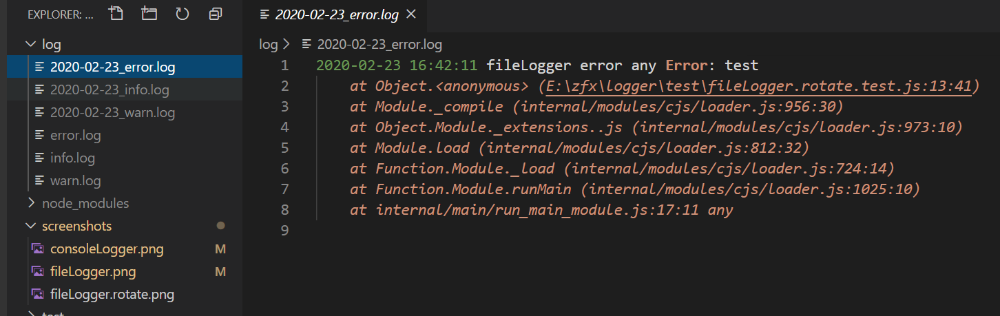

# logger
logger for nodejs

## Install

```sh
$ npm i @zhangfuxing/logger
```  

Node.js 12+ required (Because of use Class private fields)

## options
When isTTY is false, logger will not write to terminal.

### constructor  
* `dir` optional, Log folder path, if it is given, it will log to file
* `rotate` optional, Whether cut logs by day
  - default: false
* `disableConsole` optional, disable write to terminal
  - default: false

### info  
* `args` The message to write  
```ts  
info(...args: any[]): void;
``` 

### warn  
* `args` The message to write  
```ts  
warn(...args: any[]): void;
``` 

### error
* `args` The message to write  
```ts  
error(...args: any[]): void;
``` 

### disableConsole 
disable write to terminal
```ts  
disableConsole(): void;
``` 

### enableConsole 
enable write to terminal
```ts  
enableConsole(): void;
``` 

### disableFile 
disable write to file
```ts  
disableFile(): void;
``` 

### enableFile 
enable write to file
```ts  
enableFile(): void;
``` 

### disable 
disable write to file and terminal, don't care if it is currently writing to a file or terminal, but hope to restore the currently configuration later
```ts  
disable(): void;
``` 

### enable 
restore previous log configuration: file, terminal or both
```ts  
enable(): void;
``` 

## Useage  

### console logger  

```js
const Logger = require('@zhangfuxing/logger');

const logger = new Logger();

logger.info('consoleLogger info', { name: 'zfx' });
logger.warn('consoleLogger warn', 1, 'any');
logger.error('consoleLogger error', new Error('test'));
```  

### file and console logger  

```js
const Logger = require('@zhangfuxing/logger');

const logger = new Logger({
  dir: './log'
});

logger.info('fileLogger info', 'any', { name: 'zfx' });
logger.warn('fileLogger warn', 'any', 'any');
logger.error('fileLogger error', 'any', new Error('test'), 'any');
```  

### file logger only

```js
const Logger = require('@zhangfuxing/logger');

const logger = new Logger({
  dir: './log',
  disableConsole: true
});

logger.info('fileLogger info', 'any', { name: 'zfx' });
logger.warn('fileLogger warn', 'any', 'any');
logger.error('fileLogger error', 'any', new Error('test'), 'any');
```  

### file logger cut by day
```js
const Logger = require('@zhangfuxing/logger');

const logger = new Logger({
  dir: './log',
  rotate: true 
});

logger.info('fileLogger info', 'any', { name: 'zfx' });
logger.warn('fileLogger warn', 'any', 'any');
logger.error('fileLogger error', 'any', new Error('test'), 'any');
```  

## disableConsole and enableConsole
```js
const Logger = require('@zhangfuxing/logger');

const logger = new Logger();

logger.info('console enabled, you can see me');
logger.info('console will be disabled, should not see "console disabled" below ===>');
logger.disableConsole();
logger.info('console disabled');
logger.enableConsole();
logger.info('console enabled, you can see me');
```

or disableConsole is true when the logger is instantiated

```js
const Logger = require('@zhangfuxing/logger');

const logger = new Logger({
  disableConsole: true
});

logger.enableConsole();
logger.info('console enabled, you can see me');
logger.info('console will be disabled, should not see any below ===>');
logger.disableConsole();
logger.info('console disabled');
``` 

## disableFile and enableFile
```js
const Logger = require('@zhangfuxing/logger');

const logger = new Logger({
  dir: './log',
  disableConsole: true
});

logger.info('file enable');
logger.info('console will be disabled, should not see "file disbaled" below ===>');
logger.disableFile();
logger.info('file disbaled');
logger.enableFile();
logger.info('file enabled, you can see me');
```

## disable and enable

1. fileLogger => disable => enable => fileLogger 
2. consoleLogger => disable => enable => consoleLogger 
3. fileLogger, consoleLogger => disable => enable => fileLogger, consoleLogger 

```js
const Logger = require('@zhangfuxing/logger');

const consoleLogger = new Logger();
const fileLogger = new Logger({
  dir: './log',
  disableConsole: true
});
const bothLogger = new Logger({
  dir: './log'
});

// fileLogger => disable => enable => fileLogger 
fileLogger.info('print by fileLogger, should not see "fileLogger disabled"');
fileLogger.disable();
fileLogger.info('fileLogger disabled');
fileLogger.enable();
fileLogger.info('fileLogger enabled, should see me just in file');

// consoleLogger => disable => enable => consoleLogger 
consoleLogger.info('print by consoleLogger, should not see "consoleLogger disabled"');
consoleLogger.disable();
consoleLogger.info('consoleLogger disabled');
consoleLogger.enable();
consoleLogger.info('consoleLogger enabled, should see me just in terminal');

// fileLogger, consoleLogger => disable => enable => fileLogger, consoleLogger 
bothLogger.info('print by bothLogger, should not see "bothLogger disabled"');
bothLogger.disable();
bothLogger.info('bothLogger disabled');
bothLogger.enable();
bothLogger.info('bothLogger enabled, should see me both in file and terminal');
```

## Test

```sh
$ npm test
```  

More test file in the `test` folder.

## Screenshots

consoleLogger  
  

fileLogger  
 

cut logs by day  
  

More screenshots in the `screenshots` folder.